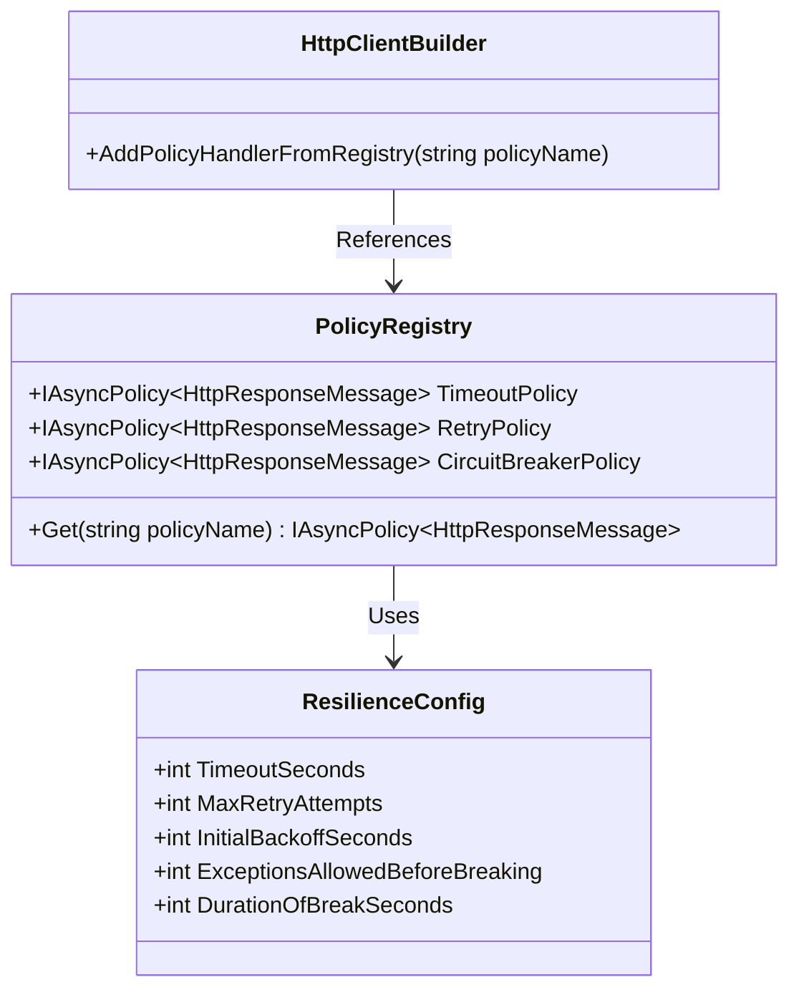
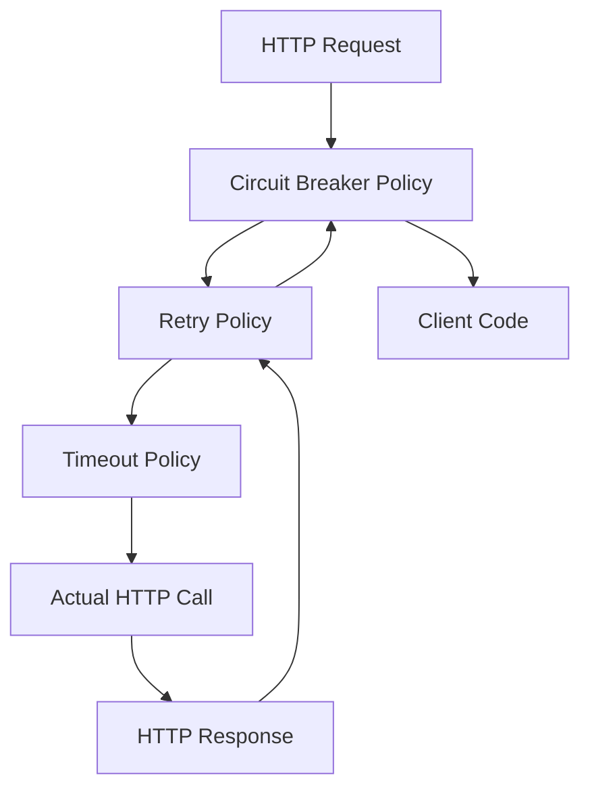

# Billing Service Resilience Refactoring

## 1. Executive Summary

This document outlines the comprehensive refactoring of the WiredBrain.Billing service's resilience mechanisms. The project addressed critical issues with the original circuit breaker implementation that was failing to maintain accurate failure counts and not opening when thresholds were exceeded. By implementing a PolicyRegistry approach, we ensured consistent policy object references across calls, corrected policy ordering, and enhanced monitoring capabilities. The refactoring has significantly improved the service's reliability, observability, and fault tolerance, ensuring more consistent behavior during downstream service disruptions.

## 2. Problem Statement

The original implementation of resilience policies in the billing service suffered from several critical issues:

### 2.1 Policy Ordering Problem

The original implementation applied policies in a suboptimal order, with the circuit breaker placed before the timeout policy. This ordering meant that when a request timed out, the circuit breaker wasn't properly notified, leading to inconsistent failure tracking.

### 2.2 Failure Counting Mechanism Issues

The `AdvancedCircuitBreakerAsync` policy was used with complex sampling parameters that made it difficult to predict when the circuit would actually open. The policy required:
- A minimum throughput threshold before considering circuit breaking
- A failure percentage threshold
- A sampling duration

This complexity led to situations where the circuit breaker would not open even when the service was experiencing consistent failures, as the sampling window and throughput requirements weren't being met consistently.

### 2.3 Inconsistent Policy References

Each HttpClient instance potentially created its own policy instances, leading to distributed failure counting across multiple policy objects rather than a centralized count. This meant that failure counts were diluted across multiple policy instances, preventing the threshold from being reached.

### 2.4 Parameter Naming Confusion

The configuration parameters for the advanced circuit breaker were confusingly named and poorly documented, making it difficult to understand their exact purpose and effect.

### 2.5 Exception Handling Issues

The original implementation had inconsistent exception handling, particularly around timeout exceptions, which weren't properly propagated to the circuit breaker.

## 3. Solution Architecture

The solution implemented a PolicyRegistry approach to ensure consistent policy object references across all calls to the payment service.

### 3.1 PolicyRegistry Structure



### 3.2 Policy Ordering

The correct policy ordering was implemented as follows:



This ensures:
1. Timeout is applied to each individual HTTP request
2. Retry is applied when a request times out or fails transiently
3. Circuit breaker only trips after retries have been exhausted

## 4. Implementation Details

### 4.1 ResiliencePolicyRegistry

A centralized `ResiliencePolicyRegistry` class was created to manage all resilience policies:

```csharp
public class ResiliencePolicyRegistry
{
    private readonly ILogger<ResiliencePolicyRegistry> _logger;
    private readonly ResilienceConfig _config;
    private readonly PolicyRegistry _registry = new();

    public ResiliencePolicyRegistry(ILogger<ResiliencePolicyRegistry> logger, IOptions<ResilienceConfig> options)
    {
        _logger = logger;
        _config = options.Value;
        
        // Register individual policies
        RegisterTimeoutPolicy();
        RegisterRetryPolicy();
        RegisterCircuitBreakerPolicy();
        
        // Register policy wrap with correct ordering
        RegisterPolicyWrap();
    }

    public IReadOnlyPolicyRegistry<string> Registry => _registry;

    // Policy registration methods...
}
```

This registry is registered as a singleton in the dependency injection container, ensuring that all HttpClient instances share the same policy objects.

### 4.2 Replacement of AdvancedCircuitBreakerAsync with CircuitBreakerAsync

The complex `AdvancedCircuitBreakerAsync` policy was replaced with the simpler `CircuitBreakerAsync` policy:

```csharp
public static IAsyncPolicy<HttpResponseMessage> Factory(ILogger logger, ResilienceConfig config)
{
    var policy = Policy
        .Handle<HttpRequestException>()
        .Or<TimeoutRejectedException>()
        .Or<TaskCanceledException>()
        .CircuitBreakerAsync(
            exceptionsAllowedBeforeBreaking: config.ExceptionsAllowedBeforeBreaking,
            durationOfBreak: config.DurationOfBreak,
            onBreak: (exception, duration) => 
            {
                CircuitState = CircuitState.Open;
                ResilienceMetrics.TrackCircuitBreakerState(CircuitState);
                
                // Logging logic...
            },
            onReset: () => 
            {
                CircuitState = CircuitState.Closed;
                ResilienceMetrics.TrackCircuitBreakerState(CircuitState);
                
                // Logging logic...
            },
            onHalfOpen: () => 
            {
                CircuitState = CircuitState.HalfOpen;
                ResilienceMetrics.TrackCircuitBreakerState(CircuitState);
                
                // Logging logic...
            });
            
    return policy.AsAsyncPolicy<HttpResponseMessage>();
}
```

This change simplified the circuit breaker logic and made it more predictable, with a straightforward count of consecutive failures rather than complex sampling logic.

### 4.3 Correct Ordering of Policies

The policies were wrapped in the correct order to ensure proper behavior:

```csharp
private void RegisterPolicyWrap()
{
    // Create a combined policy wrap with the correct ordering:
    // Circuit Breaker (outermost) -> Retry -> Timeout (innermost)
    _registry.Add("PaymentService.PolicyWrap", Policy.WrapAsync(
        _registry.Get<IAsyncPolicy<HttpResponseMessage>>("PaymentService.CircuitBreaker"),
        _registry.Get<IAsyncPolicy<HttpResponseMessage>>("PaymentService.Retry"),
        _registry.Get<IAsyncPolicy<HttpResponseMessage>>("PaymentService.Timeout")
    ));
    
    _logger.LogInformation("Resilience policy wrap registered with Circuit Breaker -> Retry -> Timeout ordering");
}
```

### 4.4 Enhanced Monitoring and Health Checks

A comprehensive monitoring system was implemented to track the state of the circuit breaker and other resilience metrics:

```csharp
public static class ResilienceMetrics
{
    // Circuit breaker state metrics
    private static readonly Gauge CircuitBreakerStateGauge = Metrics
        .CreateGauge("payment_circuit_breaker_state", 
            "Current state of the circuit breaker (0=Closed, 1=Open, 2=HalfOpen)");
    
    // Request metrics
    private static readonly Counter RequestSuccessCounter = Metrics
        .CreateCounter("payment_request_success_total", 
            "Total number of successful payment service requests");
    
    private static readonly Counter RequestFailureCounter = Metrics
        .CreateCounter("payment_request_failure_total", 
            "Total number of failed payment service requests", 
            new CounterConfiguration
            {
                LabelNames = new[] { "exception_type", "status_code" }
            });
    
    // Retry metrics, timeout metrics, and tracking methods...
}
```

A dedicated health check was also implemented to expose the circuit breaker state:

```csharp
public class CircuitBreakerHealthCheck : IHealthCheck
{
    public Task<HealthCheckResult> CheckHealthAsync(HealthCheckContext context, CancellationToken cancellationToken = default)
    {
        var circuitState = Policies.CircuitBreakerPolicy.CircuitState;
        
        return Task.FromResult(circuitState switch
        {
            CircuitState.Closed => HealthCheckResult.Healthy(
                "Payment service circuit breaker is closed. Service is operating normally."),
                
            CircuitState.HalfOpen => HealthCheckResult.Degraded(
                "Payment service circuit breaker is half-open. Service is recovering from failure."),
                
            CircuitState.Open => HealthCheckResult.Unhealthy(
                "Payment service circuit breaker is open. Service is unavailable."),
                
            _ => HealthCheckResult.Unhealthy(
                $"Payment service circuit breaker is in an unknown state: {circuitState}")
        });
    }
}
```

### 4.5 Configuration Changes

The `ResilienceConfig` class was updated to better align with the parameters of `CircuitBreakerAsync`:

```csharp
public class ResilienceConfig
{
    public int TimeoutSeconds { get; set; } = 5;
    public int MaxRetryAttempts { get; set; } = 3;
    
    /// <summary>
    /// The median first retry delay in seconds.
    /// Used by DecorrelatedJitterBackoffV2 to calculate retry delays.
    /// </summary>
    public int InitialBackoffSeconds { get; set; } = 1;

    /// <summary>
    /// Number of consecutive exceptions allowed before the circuit breaker opens.
    /// </summary>
    public int ExceptionsAllowedBeforeBreaking { get; set; } = 3;
    
    /// <summary>
    /// Duration in seconds that the circuit breaker stays open before transitioning to half-open.
    /// </summary>
    public int DurationOfBreakSeconds { get; set; } = 30;

    // Convenience properties for TimeSpan conversion
    public TimeSpan Timeout => TimeSpan.FromSeconds(TimeoutSeconds);
    public TimeSpan InitialBackoff => TimeSpan.FromSeconds(InitialBackoffSeconds);
    public TimeSpan DurationOfBreak => TimeSpan.FromSeconds(DurationOfBreakSeconds);
}
```

## 5. Benefits and Improvements

The refactoring has delivered several key benefits:

### 5.1 Consistent Policy References

Using PolicyRegistry ensures all HttpClient instances share the same policy objects, leading to centralized failure counting and more predictable circuit breaker behavior.

### 5.2 Correct Policy Ordering

The proper ordering of policies (Circuit Breaker -> Retry -> Timeout) ensures that timeouts are properly counted as failures and that the circuit breaker opens appropriately when the service is experiencing issues.

### 5.3 Simplified Circuit Breaker

Using `CircuitBreakerAsync` instead of `AdvancedCircuitBreakerAsync` provides more straightforward failure counting based on consecutive failures rather than complex sampling logic.

### 5.4 Improved Configuration

Better parameter naming and documentation make it easier to understand and configure the resilience policies.

### 5.5 Enhanced Monitoring

Comprehensive metrics and health checks provide better visibility into the state of the service and its resilience mechanisms.

### 5.6 Better Exception Handling

More consistent handling of different exception types ensures that all relevant failures are properly tracked and handled.

## 6. Future Recommendations

While the current implementation significantly improves the resilience of the billing service, there are several potential enhancements for the future:

### 6.1 Bulkhead Isolation

Consider implementing bulkhead isolation to limit the number of concurrent requests to the payment service, preventing resource exhaustion during high load.

### 6.2 Fallback Mechanisms

Implement fallback mechanisms for critical operations, such as storing payment requests in a local queue when the payment service is unavailable and processing them when the service recovers.

### 6.3 Adaptive Timeouts

Consider implementing adaptive timeouts that adjust based on the observed performance of the payment service, rather than using fixed timeout values.

### 6.4 Enhanced Metrics and Dashboards

Develop more comprehensive dashboards to visualize the resilience metrics, making it easier to identify patterns and issues.

### 6.5 Chaos Testing

Implement chaos testing to regularly verify that the resilience mechanisms work as expected under various failure scenarios.

### 6.6 Distributed Circuit Breaking

For larger systems with multiple instances of the billing service, consider implementing a distributed circuit breaker that shares state across instances.

### 6.7 Upgrade to Polly v8

Consider upgrading to Polly v8 when it becomes stable, which offers a more modern API and additional features.

---

This refactoring project has significantly improved the reliability and fault tolerance of the WiredBrain.Billing service, ensuring more consistent behavior during downstream service disruptions and providing better visibility into the system's health.