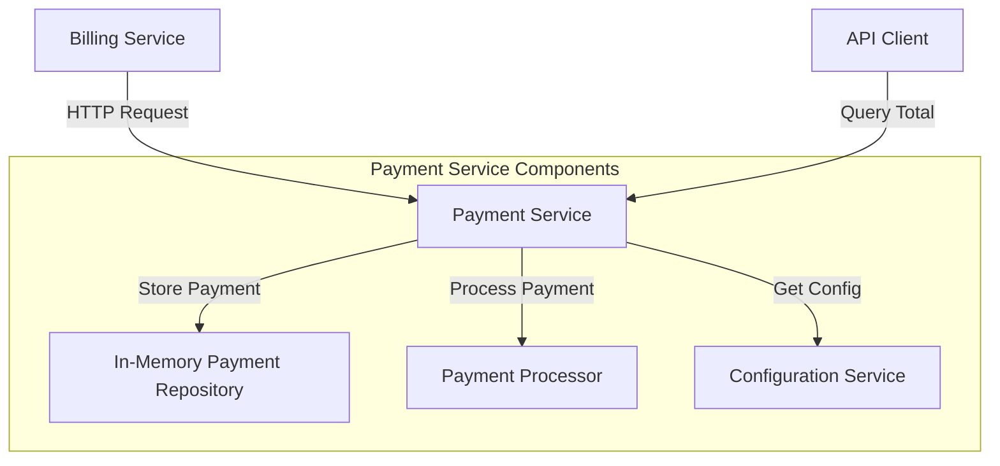
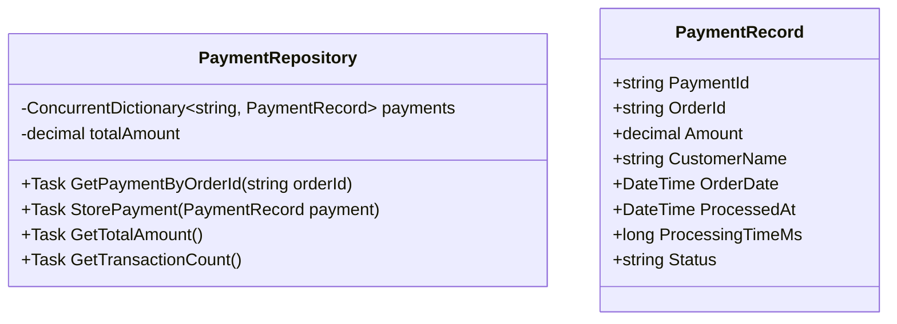
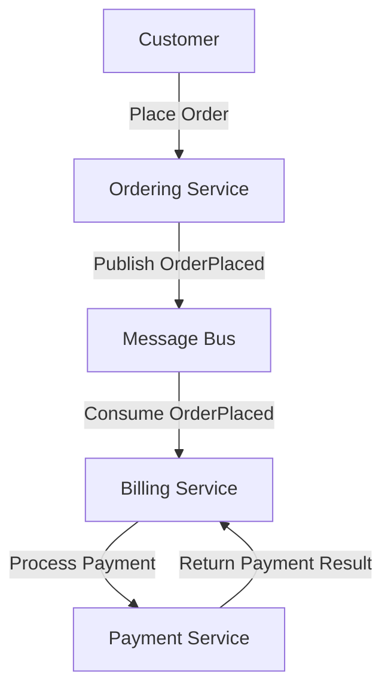

# Payment Service Architecture Plan

## 1. Service Structure and Components

The payment service will be structured as follows:



### Key Components:

1. **Controllers**
   - `PaymentController`: Handles payment processing requests and total amount queries
   - `ConfigurationController`: Manages service configuration (processing delay)

2. **Services**
   - `PaymentProcessorService`: Handles payment processing logic with configurable delay
   - `PaymentRepository`: Stores payment records and handles idempotency checks

3. **Models**
   - `PaymentRequest`: Incoming payment request model
   - `PaymentResponse`: Outgoing payment response model
   - `PaymentRecord`: Internal payment record model
   - `PaymentConfiguration`: Configuration settings model

## 2. API Endpoint Definitions

### Payment Processing Endpoint

```
POST /api/payment/process
```

**Request:**
```json
{
  "orderId": "guid-string",
  "amount": 123.45,
  "customerName": "string",
  "orderDate": "2025-05-24T12:00:00Z"
}
```

**Response:**
```json
{
  "paymentId": "guid-string",
  "orderId": "guid-string",
  "amount": 123.45,
  "status": "Succeeded",
  "processedAt": "2025-05-24T12:01:00Z",
  "processingTimeMs": 500
}
```

**Status Codes:**
- 200 OK: Payment processed successfully
- 200 OK: Payment already processed (idempotent response)
- 400 Bad Request: Invalid request data
- 500 Internal Server Error: Processing error

### Total Amount Query Endpoint

```
GET /api/payment/total
```

**Response:**
```json
{
  "totalAmount": 12345.67,
  "transactionCount": 100,
  "lastUpdated": "2025-05-24T12:01:00Z"
}
```

### Configuration Endpoint

```
GET /api/payment/configuration
```

**Response:**
```json
{
  "processingDelayMs": 200
}
```

```
PUT /api/payment/configuration
```

**Request:**
```json
{
  "processingDelayMs": 500
}
```

**Response:**
```json
{
  "processingDelayMs": 500,
  "updatedAt": "2025-05-24T12:01:00Z"
}
```

## 3. Data Storage Approach

The payment service will use in-memory data structures for storing payment records and tracking the total amount billed:



### Idempotency Implementation:

1. The `orderId` will be used as the key for idempotency checks
2. Before processing a payment, the service will check if a payment with the same `orderId` already exists
3. If a payment record exists, the service will return the existing record without reprocessing
4. If no record exists, the service will process the payment and store the record

```csharp
// Pseudocode for idempotency handling
public async Task<PaymentResponse> ProcessPayment(PaymentRequest request)
{
    // Check if payment already exists
    var existingPayment = await _repository.GetPaymentByOrderId(request.OrderId);
    
    if (existingPayment != null)
    {
        // Return existing payment record (idempotent response)
        return MapToResponse(existingPayment);
    }
    
    // Process new payment
    var paymentRecord = await _paymentProcessor.ProcessPayment(request);
    
    // Store payment record
    await _repository.StorePayment(paymentRecord);
    
    // Return response
    return MapToResponse(paymentRecord);
}
```

## 4. Configuration

The payment service will use the following configuration approach:

1. **appsettings.json** for static configuration:

```json
{
  "Logging": {
    "LogLevel": {
      "Default": "Information",
      "Microsoft.AspNetCore": "Warning"
    }
  },
  "AllowedHosts": "*",
  "PaymentService": {
    "DefaultProcessingDelayMs": 200
  }
}
```

2. **In-memory configuration service** for dynamic configuration:

```csharp
// Pseudocode for configuration service
public class PaymentConfigurationService
{
    private PaymentConfiguration _configuration;
    private readonly object _lock = new object();
    
    public PaymentConfigurationService(IConfiguration configuration)
    {
        // Initialize from appsettings.json
        _configuration = new PaymentConfiguration
        {
            ProcessingDelayMs = configuration.GetValue<int>("PaymentService:DefaultProcessingDelayMs", 200)
        };
    }
    
    public PaymentConfiguration GetConfiguration()
    {
        lock (_lock)
        {
            return _configuration;
        }
    }
    
    public PaymentConfiguration UpdateConfiguration(PaymentConfiguration newConfig)
    {
        lock (_lock)
        {
            _configuration = newConfig;
            _configuration.UpdatedAt = DateTime.UtcNow;
            return _configuration;
        }
    }
}
```

## 6. Implementation Details

### Project Structure

```
WiredBrain.Payment/
├── Controllers/
│   ├── PaymentController.cs
│   └── ConfigurationController.cs
├── Services/
│   ├── PaymentProcessorService.cs
│   └── PaymentRepository.cs
├── Models/
│   ├── PaymentRequest.cs
│   ├── PaymentResponse.cs
│   ├── PaymentRecord.cs
│   └── PaymentConfiguration.cs
├── Program.cs
├── appsettings.json
├── appsettings.Development.json
└── Dockerfile
```

### Key Implementation Considerations

1. **Thread Safety**: The payment repository will use thread-safe collections (ConcurrentDictionary) to handle concurrent requests.

2. **Error Handling**: Basic error handling for the simulation environment.

3. **Validation**: Simple request validation to ensure required fields are present.

4. **Performance**: Asynchronous methods to handle requests efficiently.

### Dockerfile

```dockerfile
FROM mcr.microsoft.com/dotnet/aspnet:8.0 AS base
WORKDIR /app
EXPOSE 80
EXPOSE 443

FROM mcr.microsoft.com/dotnet/sdk:8.0 AS build
WORKDIR /src
COPY ["WiredBrain.Payment/WiredBrain.Payment.csproj", "WiredBrain.Payment/"]
RUN dotnet restore "WiredBrain.Payment/WiredBrain.Payment.csproj"
COPY . .
WORKDIR "/src/WiredBrain.Payment"
RUN dotnet build "WiredBrain.Payment.csproj" -c Release -o /app/build

FROM build AS publish
RUN dotnet publish "WiredBrain.Payment.csproj" -c Release -o /app/publish

FROM base AS final
WORKDIR /app
COPY --from=publish /app/publish .
ENTRYPOINT ["dotnet", "WiredBrain.Payment.dll"]
```

## 7. Integration with Existing System

The payment service will integrate with the existing WiredBrain system as follows:



1. The Billing Service will call the Payment Service's HTTP endpoint to process payments.
2. The Payment Service will not publish messages to the message bus.