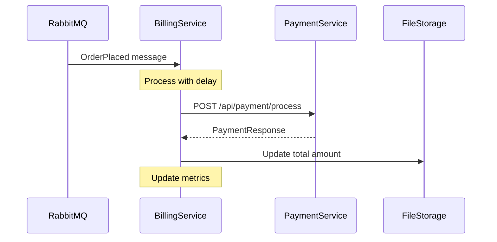

# Billing Service to Payment Service Integration Plan

## 1. Current Architecture Analysis

### Billing Service (WiredBrain.Billing)
- Receives `OrderPlaced` messages from RabbitMQ via MassTransit
- Processes orders with a configurable delay
- Tracks metrics using Prometheus
- Currently does not call the payment service
- No mechanism to track total amount charged

### Payment Service (Simulated.Payments)
- Provides REST API endpoints for payment processing
- Endpoint at `/api/payment/process` accepts `PaymentRequest` objects
- Returns `PaymentResponse` objects
- Tracks total amount paid in memory
- Provides idempotency support (won't process the same order ID twice)
- Configurable processing delay

## 2. Integration Requirements

1. **API Communication**: Billing service needs to call the payment service API
2. **Data Mapping**: Map `OrderPlaced` message to `PaymentRequest`
3. **Response Handling**: Process the `PaymentResponse` from the payment service
4. **Durable Storage**: Implement file-based storage for tracking total amount charged
5. **Docker Configuration**: Update Docker configuration to mount a volume for persistent storage

## 3. Implementation Plan

### 3.1 Add HTTP Client in Billing Service

1. **Create HTTP Client Factory**:
   - Add HttpClient configuration in `Program.cs`
   - Configure base address for the payment service
   - Configure timeout settings

```csharp
// In Program.cs
builder.Services.AddHttpClient("PaymentService", client =>
{
    client.BaseAddress = new Uri("http://simulated-payments:80/");
    client.Timeout = TimeSpan.FromSeconds(5); // 5-second timeout
});
```

### 3.2 Create Payment Service Client

1. **Create Models**:
   - Create models that match the payment service API models
   - `PaymentRequest.cs`, `PaymentResponse.cs`

2. **Create Payment Service Client**:
   - Create a service to handle communication with the payment service
   - Implement methods to process payments

```csharp
// PaymentServiceClient.cs
public class PaymentServiceClient
{
    private readonly HttpClient _httpClient;
    private readonly ILogger<PaymentServiceClient> _logger;

    public PaymentServiceClient(IHttpClientFactory httpClientFactory, ILogger<PaymentServiceClient> logger)
    {
        _httpClient = httpClientFactory.CreateClient("PaymentService");
        _logger = logger;
    }

    public async Task<PaymentResponse> ProcessPaymentAsync(PaymentRequest request)
    {
        try
        {
            var response = await _httpClient.PostAsJsonAsync("api/payment/process", request);
            response.EnsureSuccessStatusCode();
            return await response.Content.ReadFromJsonAsync<PaymentResponse>();
        }
        catch (Exception ex)
        {
            _logger.LogError(ex, "Error processing payment for order {OrderId}", request.OrderId);
            throw;
        }
    }
}
```

### 3.3 Create Billing Repository for Durable Storage

1. **Create Billing Repository**:
   - Implement a repository to track total amount charged
   - Use file-based storage for durability

```csharp
// BillingRepository.cs
public class BillingRepository
{
    private readonly string _filePath;
    private readonly object _lock = new object();
    private decimal _totalAmount;
    private int _transactionCount;
    private DateTime _lastUpdated;

    public BillingRepository(IConfiguration configuration)
    {
        // Get file path from configuration
        _filePath = configuration["Billing:StorageFilePath"] ?? "/data/billing.json";
        LoadFromFile();
    }

    public void AddCharge(decimal amount)
    {
        lock (_lock)
        {
            _totalAmount += amount;
            _transactionCount++;
            _lastUpdated = DateTime.UtcNow;
            SaveToFile();
        }
    }

    public (decimal TotalAmount, int TransactionCount, DateTime LastUpdated) GetTotals()
    {
        lock (_lock)
        {
            return (_totalAmount, _transactionCount, _lastUpdated);
        }
    }

    private void LoadFromFile()
    {
        try
        {
            if (File.Exists(_filePath))
            {
                var json = File.ReadAllText(_filePath);
                var data = JsonSerializer.Deserialize<BillingData>(json);
                if (data != null)
                {
                    _totalAmount = data.TotalAmount;
                    _transactionCount = data.TransactionCount;
                    _lastUpdated = data.LastUpdated;
                }
            }
        }
        catch (Exception ex)
        {
            // Log error but continue with default values
            Console.WriteLine($"Error loading billing data: {ex.Message}");
        }
    }

    private void SaveToFile()
    {
        try
        {
            // Ensure directory exists
            var directory = Path.GetDirectoryName(_filePath);
            if (!string.IsNullOrEmpty(directory) && !Directory.Exists(directory))
            {
                Directory.CreateDirectory(directory);
            }

            var data = new BillingData
            {
                TotalAmount = _totalAmount,
                TransactionCount = _transactionCount,
                LastUpdated = _lastUpdated
            };

            var json = JsonSerializer.Serialize(data);
            File.WriteAllText(_filePath, json);
        }
        catch (Exception ex)
        {
            // Log error but continue
            Console.WriteLine($"Error saving billing data: {ex.Message}");
        }
    }

    private class BillingData
    {
        public decimal TotalAmount { get; set; }
        public int TransactionCount { get; set; }
        public DateTime LastUpdated { get; set; }
    }
}
```

### 3.4 Update OrderPlacedConsumer

1. **Modify OrderPlacedConsumer**:
   - Inject the PaymentServiceClient and BillingRepository
   - Call the payment service when processing an order
   - Update the billing repository with the charged amount

```csharp
// OrderPlacedConsumer.cs
public class OrderPlacedConsumer : IConsumer<OrderPlaced>
{
    private readonly PaymentServiceClient _paymentServiceClient;
    private readonly BillingRepository _billingRepository;
    private readonly ILogger<OrderPlacedConsumer> _logger;

    public OrderPlacedConsumer(
        PaymentServiceClient paymentServiceClient,
        BillingRepository billingRepository,
        ILogger<OrderPlacedConsumer> logger)
    {
        _paymentServiceClient = paymentServiceClient;
        _billingRepository = billingRepository;
        _logger = logger;
    }

    public async Task Consume(ConsumeContext<OrderPlaced> context)
    {
        var order = context.Message;
        var stopwatch = Stopwatch.StartNew();

        Console.WriteLine($"Processing payment for order: {order.OrderId} for {order.CustomerName} - ${order.Amount}");
        
        // Use the delay directly from the message
        Console.WriteLine($"Processing order with delay: {order.BillingProcessingDelayMs}ms (cs: {order.CoefficientOfServiceVariation})");
        
        // Use the delay from the message for billing processing
        await Task.Delay(order.BillingProcessingDelayMs);
        
        // Create payment request
        var paymentRequest = new PaymentRequest
        {
            OrderId = order.OrderId,
            Amount = order.Amount,
            CustomerName = order.CustomerName,
            OrderDate = order.OrderDate
        };

        try
        {
            // Process payment through the payment service
            var paymentResponse = await _paymentServiceClient.ProcessPaymentAsync(paymentRequest);
            
            // Record the charge in the repository
            _billingRepository.AddCharge(order.Amount);
            
            Console.WriteLine($"Payment processed successfully for order: {order.OrderId}, Payment ID: {paymentResponse.PaymentId}");
        }
        catch (Exception ex)
        {
            _logger.LogError(ex, "Failed to process payment for order {OrderId}", order.OrderId);
            throw; // Rethrow to trigger retry
        }
        
        stopwatch.Stop();
        
        // Convert milliseconds to seconds for the processing time metric
        double processingTimeSeconds = stopwatch.Elapsed.TotalSeconds;
        BillingMetrics.TrackProcessingTime(processingTimeSeconds);

        // Total wait time (W) includes both the time in queue and the processing time
        var waitTime = (DateTime.UtcNow - order.OrderDate).TotalSeconds;
        BillingMetrics.TrackWaitTime(waitTime);
    }
}
```

### 3.5 Update BillingController

1. **Enhance BillingController**:
   - Add endpoint to get total amount charged
   - Use the BillingRepository to retrieve the data

```csharp
// BillingController.cs
[ApiController]
[Route("[controller]")]
public class BillingController : ControllerBase
{
    private readonly ILogger<BillingController> _logger;
    private readonly BillingRepository _billingRepository;

    public BillingController(ILogger<BillingController> logger, BillingRepository billingRepository)
    {
        _logger = logger;
        _billingRepository = billingRepository;
    }

    [HttpGet]
    public IActionResult Get()
    {
        return Ok("Billing Service is running.");
    }

    [HttpGet("total")]
    public IActionResult GetTotal()
    {
        var (totalAmount, transactionCount, lastUpdated) = _billingRepository.GetTotals();
        
        return Ok(new
        {
            TotalAmount = totalAmount,
            TransactionCount = transactionCount,
            LastUpdated = lastUpdated
        });
    }
}
```

### 3.6 Update Docker Configuration

1. **Update Dockerfile**:
   - Ensure the container has a volume mount point for persistent storage

```dockerfile
# In Dockerfile
# Create directory for persistent storage
RUN mkdir -p /data
VOLUME /data
```

2. **Update docker-compose.yml**:
   - Add volume configuration for the billing service

```yaml
# In docker-compose.yml
services:
  billing:
    # ... existing configuration ...
    volumes:
      - billing-data:/data

volumes:
  billing-data:
```

### 3.7 Update Configuration

1. **Update appsettings.json**:
   - Add configuration for the payment service and storage

```json
{
  "Billing": {
    "StorageFilePath": "/data/billing.json"
  },
  "PaymentService": {
    "BaseUrl": "http://simulated-payments:80/"
  }
}
```

## 4. Testing Plan

**Manual Testing**:
   - Follow the steps in the README to verify the integration works:
     1. Start the Docker Compose stack
     2. Observe the billing service logs to confirm it's processing orders
     3. Check the payment service logs to confirm it's receiving and processing payment requests
     4. Use the billing service API to check the total amount charged
     5. Use the payment service API to check the total amount paid
     6. Verify that the totals match
   - Test container restart to ensure data persistence:
     1. Stop and restart the billing service container
     2. Verify that the total amount charged is preserved

## 5. Implementation Sequence

1. Create the models for payment service communication
2. Implement the BillingRepository for durable storage
3. Create the PaymentServiceClient
4. Update the OrderPlacedConsumer to use these new components
5. Enhance the BillingController with the total endpoint
6. Update Docker configuration for volume mounting
7. Update configuration files
8. Test the implementation

## 6. Integration Flow Diagram



## 7. Component Architecture Diagram

```mermaid
graph TD
    A[RabbitMQ] -->|OrderPlaced| B[OrderPlacedConsumer]
    B --> C[PaymentServiceClient]
    C -->|HTTP Request| D[Payment Service API]
    D -->|HTTP Response| C
    B --> E[BillingRepository]
    E -->|Read/Write| F[File Storage]
    G[BillingController] --> E
    H[API Client] -->|GET /billing/total| G