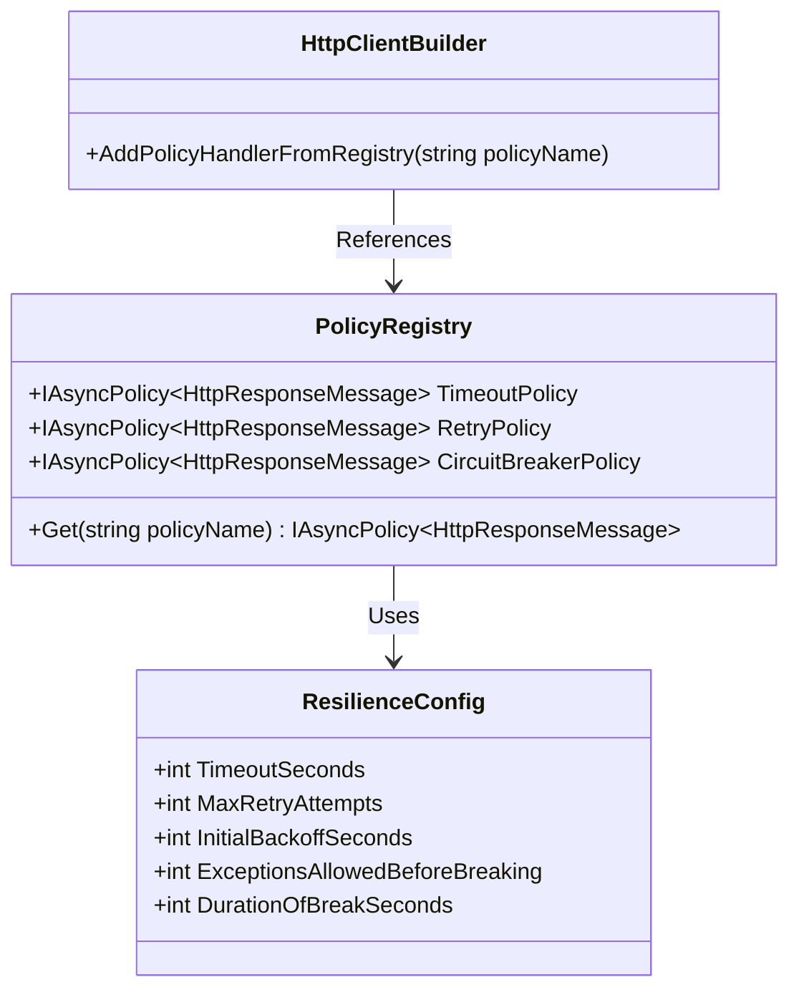
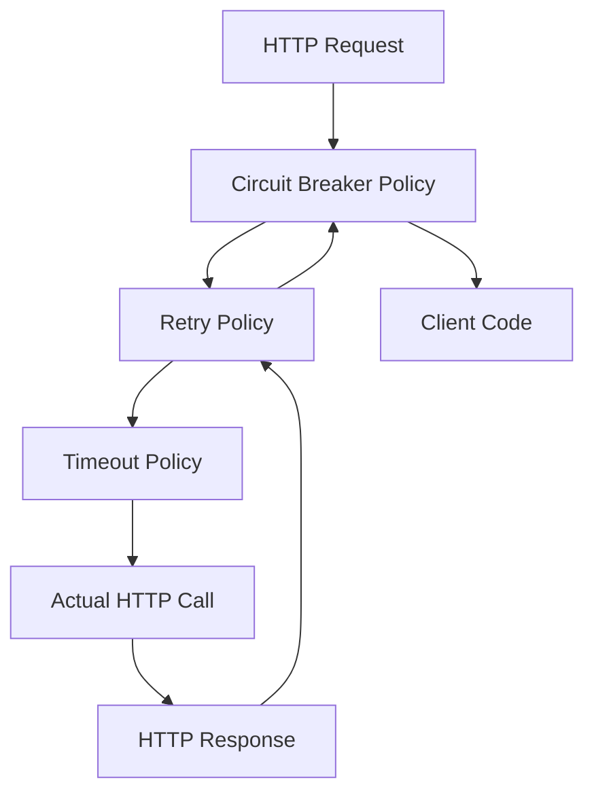

# PolicyRegistry Refactoring Design Plan

## 1. Overview

This design plan outlines a comprehensive approach to refactoring the current Polly policy implementation in the WiredBrain.Billing service using a PolicyRegistry. The refactoring will address several identified issues:

1. Policy ordering problem (circuit breaker before timeout)
2. Failure counting mechanism issues with AdvancedCircuitBreakerAsync
3. Sampling duration concerns
4. Parameter naming confusion
5. Exception handling issues

## 2. PolicyRegistry Structure

### 2.1 Registry Design

We will implement a centralized PolicyRegistry as a singleton service that will:

- Store all resilience policies with consistent naming
- Ensure policies are created only once and reused
- Allow for proper policy ordering
- Simplify policy configuration and maintenance



## 3. Policy Definitions and Naming

### 3.1 Policy Names

We will use consistent, descriptive names for all policies:

- `PaymentService.Timeout` - For the timeout policy
- `PaymentService.Retry` - For the retry policy
- `PaymentService.CircuitBreaker` - For the circuit breaker policy
- `PaymentService.PolicyWrap` - For the combined policy wrap

### 3.2 Policy Implementations

#### 3.2.1 Timeout Policy

The timeout policy will remain largely unchanged but will be registered with a consistent name:

```csharp
registry.Add("PaymentService.Timeout", Policy.TimeoutAsync<HttpResponseMessage>(config.Timeout));
```

#### 3.2.2 Retry Policy

The retry policy will continue to use DecorrelatedJitterBackoffV2 but will be registered with a consistent name:

```csharp
registry.Add("PaymentService.Retry", HttpPolicyExtensions
    .HandleTransientHttpError()
    .Or<TimeoutRejectedException>()
    .WaitAndRetryAsync(
        Polly.Contrib.WaitAndRetry.Backoff.DecorrelatedJitterBackoffV2(
            medianFirstRetryDelay: config.InitialBackoff,
            retryCount: config.MaxRetryAttempts),
        onRetry: (outcome, timespan, retryAttempt, context) => 
        {
            // Logging logic
        }
    ));
```

#### 3.2.3 Circuit Breaker Policy

Replace AdvancedCircuitBreakerAsync with the simpler CircuitBreakerAsync:

```csharp
registry.Add("PaymentService.CircuitBreaker", HttpPolicyExtensions
    .HandleTransientHttpError()
    .Or<TimeoutRejectedException>()
    .Or<TaskCanceledException>()
    .CircuitBreakerAsync(
        exceptionsAllowedBeforeBreaking: config.ExceptionsAllowedBeforeBreaking,
        durationOfBreak: config.DurationOfBreak,
        onBreak: (ex, duration) => 
        {
            // Logging logic
        },
        onReset: () => 
        {
            // Logging logic
        },
        onHalfOpen: () => 
        {
            // Logging logic
        }
    ));
```

#### 3.2.4 Policy Wrap

Create a combined policy wrap with the correct ordering:

```csharp
registry.Add("PaymentService.PolicyWrap", Policy.WrapAsync(
    registry.Get<IAsyncPolicy<HttpResponseMessage>>("PaymentService.CircuitBreaker"),
    registry.Get<IAsyncPolicy<HttpResponseMessage>>("PaymentService.Retry"),
    registry.Get<IAsyncPolicy<HttpResponseMessage>>("PaymentService.Timeout")
));
```

## 4. Configuration Changes

### 4.1 ResilienceConfig Model Updates

Update the ResilienceConfig class to better align with the parameters of CircuitBreakerAsync:

```csharp
public class ResilienceConfig
{
    public int TimeoutSeconds { get; set; } = 5;
    public int MaxRetryAttempts { get; set; } = 3;
    
    /// <summary>
    /// The median first retry delay in seconds.
    /// Used by DecorrelatedJitterBackoffV2 to calculate retry delays.
    /// </summary>
    public int InitialBackoffSeconds { get; set; } = 1;

    /// <summary>
    /// Number of consecutive exceptions allowed before the circuit breaker opens.
    /// </summary>
    public int ExceptionsAllowedBeforeBreaking { get; set; } = 3;
    
    /// <summary>
    /// Duration in seconds that the circuit breaker stays open before transitioning to half-open.
    /// </summary>
    public int DurationOfBreakSeconds { get; set; } = 30;

    // Remove SamplingDurationSeconds as it's not used with CircuitBreakerAsync

    public TimeSpan Timeout => TimeSpan.FromSeconds(TimeoutSeconds);
    public TimeSpan InitialBackoff => TimeSpan.FromSeconds(InitialBackoffSeconds);
    public TimeSpan DurationOfBreak => TimeSpan.FromSeconds(DurationOfBreakSeconds);
}
```

### 4.2 appsettings.json Updates

Update the appsettings.json file to align with the new configuration model:

```json
"PaymentService": {
  "BaseUrl": "http://simulated-payments:80/",
  "Resilience": {
    "TimeoutSeconds": 5,
    "MaxRetryAttempts": 3,
    "InitialBackoffSeconds": 1,
    "ExceptionsAllowedBeforeBreaking": 3,
    "DurationOfBreakSeconds": 30
  }
}
```

## 5. Implementation Plan

### 5.1 Create PolicyRegistry Service

Create a new service to manage the PolicyRegistry:

```csharp
public class ResiliencePolicyRegistry
{
    private readonly ILogger<ResiliencePolicyRegistry> _logger;
    private readonly ResilienceConfig _config;
    private readonly PolicyRegistry _registry = new();

    public ResiliencePolicyRegistry(ILogger<ResiliencePolicyRegistry> logger, IOptions<ResilienceConfig> options)
    {
        _logger = logger;
        _config = options.Value;
        
        // Register individual policies
        RegisterTimeoutPolicy();
        RegisterRetryPolicy();
        RegisterCircuitBreakerPolicy();
        
        // Register policy wrap with correct ordering
        RegisterPolicyWrap();
    }

    public IReadOnlyPolicyRegistry<string> Registry => _registry;

    private void RegisterTimeoutPolicy()
    {
        // Implementation
    }

    private void RegisterRetryPolicy()
    {
        // Implementation
    }

    private void RegisterCircuitBreakerPolicy()
    {
        // Implementation
    }

    private void RegisterPolicyWrap()
    {
        // Implementation with correct ordering:
        // Circuit Breaker (outermost) -> Retry -> Timeout (innermost)
    }
}
```

### 5.2 Register PolicyRegistry in DI Container

Update Program.cs to register the PolicyRegistry as a singleton:

```csharp
// Register resilience policies
builder.Services.AddSingleton<ResiliencePolicyRegistry>();
```

### 5.3 Update HttpClient Registration

Modify the HttpClient registration to use the PolicyRegistry:

```csharp
builder.Services.AddHttpClient("PaymentService", (serviceProvider, client) =>
{
    client.BaseAddress = new Uri(builder.Configuration["PaymentService:BaseUrl"] ?? "http://simulated-payments:80/");
})
.AddPolicyHandlerFromRegistry((serviceProvider, _) => 
{
    var registry = serviceProvider.GetRequiredService<ResiliencePolicyRegistry>().Registry;
    return "PaymentService.PolicyWrap";
});
```

## 6. Exception Handling

Ensure consistent exception handling across all policies:

1. Handle `HttpRequestException` for network and HTTP errors
2. Handle `TimeoutRejectedException` for timeout errors
3. Handle `TaskCanceledException` for cancellation errors
4. Handle `BrokenCircuitException` for circuit breaker open errors

The PaymentServiceClient will continue to handle these exceptions, but with improved logging and error messages.

## 7. Policy Ordering

The correct policy ordering will be:



This ensures:
1. Timeout is applied to each individual HTTP request
2. Retry is applied when a request times out or fails transiently
3. Circuit breaker only trips after retries have been exhausted

## 8. Benefits of the Refactoring

1. **Consistent Policy References**: Using PolicyRegistry ensures all HttpClient instances share the same policy objects
2. **Correct Policy Ordering**: Ensures policies are applied in the optimal order
3. **Simplified Circuit Breaker**: Using CircuitBreakerAsync provides more straightforward failure counting
4. **Improved Configuration**: Better parameter naming and removal of unused parameters
5. **Enhanced Maintainability**: Centralized policy definitions make future changes easier
6. **Better Exception Handling**: More consistent handling of different exception types

## 9. Migration Strategy

1. Create the new PolicyRegistry implementation
2. Update the ResilienceConfig model
3. Update the HttpClient registration
4. Test the new implementation
5. Remove the old policy implementations once the new approach is verified

This approach allows for a smooth transition with minimal risk.